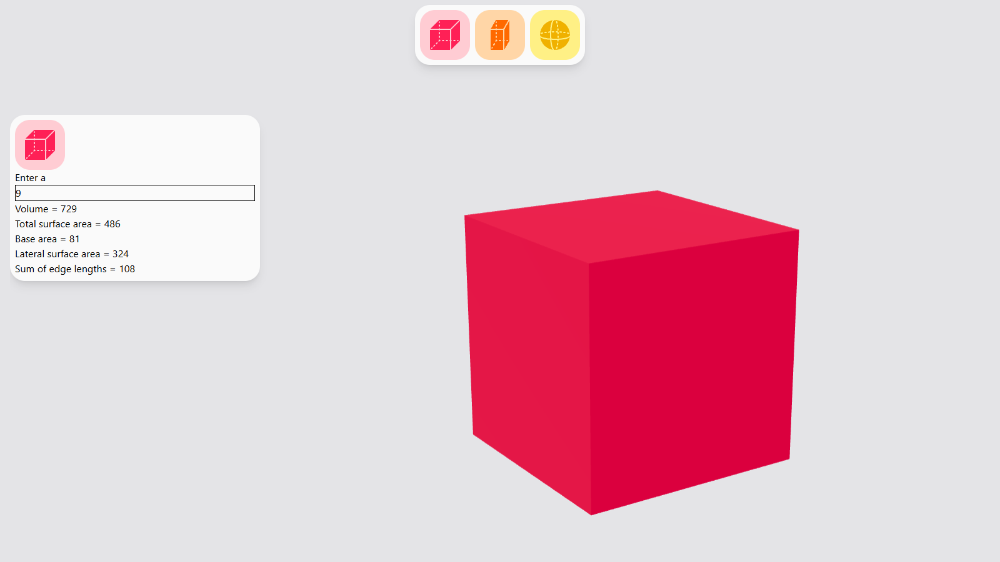

# Geometric Calc

A simple web app for calculating values of 3D geometric shapes. Users enter dimensions such as length, width, height, or radius, and the app instantly shows calculated results. The app also provides a real-time 3D preview that updates as you change values, so you can see the shape and understand how dimensions affect its form. The interface is clean and responsive, making it easy to use on both desktop and mobile devices.

[**➥ Live**](https://oke225.github.io/Geometric-Calc/)

## ⚙️ Technologies

## ⭐ Features

- Real-time 3D visualization of the selected shape
- Input fields for dimensions with instant updates
- Calculate various values for a chosen figure
- Interactive preview to better understand the geometry
- Clean UI

## 🔎 See Also

- [My Website](https://pj-portfolio-cv.vercel.app)
- [My GitHub profile](https://github.com/OKE225)
